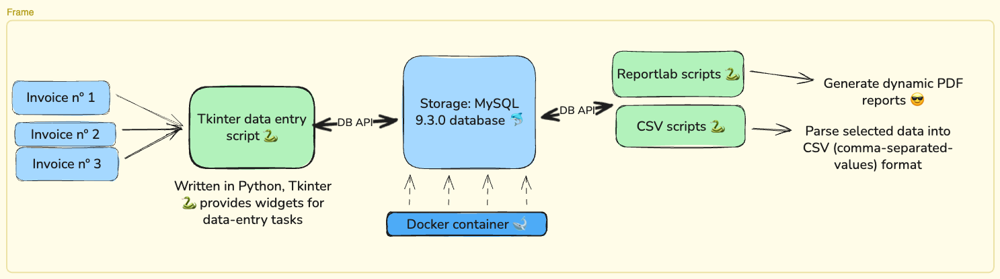

# 🧾 VAT Refunder: Automated Invoice & Reporting Pipeline


> **Note:** *This project was engineered to solve data fragmentation in a high-security government environment. Some specific operational terms have been generalized for this public repository.*

---

## 🏗️ System Architecture

*(Ensure the image file you created is named `python_sql_automation_architecture.png` and is in the root of the repo)*

---

## 🔻 The Problem

In a high-security government environment, invoice processing and VAT reporting were handled manually via Excel. This resulted in:

* **Bottlenecks:** Slow turnaround times for mandatory monthly reporting.
* **Data Integrity Risks:** High probability of manual data entry errors.
* **Data Silos:** Lack of a centralized, queryable database for historical tracking and auditing.

---

## 💡 The Solution

I engineered an **offline, full-stack automation tool** using Python and MySQL, containerized via Docker to ensure stability across different office machines (Windows/Linux).

It automates the VAT-refund workflow—handling invoice tracking, voucher generation, and quarterly reporting. The application was designed specifically for administrative environments that require **auditable data entry** and **zero-trust offline capability**.

---

## 🚀 Key Features

* **🖥️ Custom GUI:** Tkinter-based data entry interface for tracking "Chancery" and "Residence" cost centers.
* **📄 Auto-Reporting:** One-click generation of government-compliant PDF and CSV reports (via **ReportLab**).
* **🐳 Containerized Backend:** Dockerized MySQL 9.3 instance ensures easy setup and data persistence without polluting the host OS.
* **⚡ Smart Launcher:** Cross-platform entry point (`start.sh`) that auto-provisions a Python virtual environment and manages container states.
* **📂 Auto-Export:** CSV exports are automatically routed to the user's desktop for external auditing (`~/Desktop/exports`).

---

## 🧩 Requirements

* **Docker** + Docker Compose plugin
* **Python** ≥ 3.10
* **OS:** Linux or macOS (Developed and tested on Fedora 42)

---

## ⚙️ Installation & Setup

```bash
# 1. Clone the repository
git clone [https://github.com/DariusDefoe/madrid-mission-hub.git](https://github.com/DariusDefoe/madrid-mission-hub.git)
cd madrid-mission-hub/vat_refunder

# 2. Configure Environment
cp .env.example .env
# (Optional) Edit .env to adjust database credentials

# 3. Install Dependencies
chmod +x setup.sh
./setup.sh

# 4. Launch Application (Starts MySQL Container + GUI)
chmod +x start.sh
./start.sh
